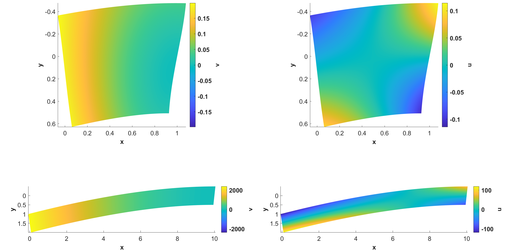

# Biharmonic Plate Solution

This repository implements a numerical solver for the in–plane displacements and stresses of a clamped rectangular plate subjected to transverse loading.  The formulation integrates the plane–stress constitutive laws to satisfy shear compatibility and the clamped/free boundary conditions.

## Theory

For a thin, linearly elastic plate the Airy stress function satisfies the biharmonic equation
\nabla^4\Phi = q(x,y)
where \(q\) is the applied load.  Here the load is taken as an exponential distribution \(w(x)=w_0 e^{k x/\ell}\) along the span.  Stresses are recovered from the Airy function and in–plane displacements \(u(x,y)\) and \(v(x,y)\) follow from integrating the plane–stress strains.  The series solution is truncated to a specified number of Fourier modes.

## Running the code

The scripts are written for MATLAB or GNU Octave.  To reproduce the figures:

```matlab
% at the MATLAB/Octave prompt
>> Main
```

`Main.m` constructs `Plate` objects for several slenderness values and calls the plotting routines.  Additional plots such as `plot_displacement_exp` or `plot_stresses_exp` can be enabled in `Main.m`.

## Example output




## References

1. S. Timoshenko and S. Woinowsky-Krieger, *Theory of Plates and Shells*, McGraw–Hill, 1959.
2. J. N. Reddy, *Theory and Analysis of Elastic Plates and Shells*, CRC Press, 2006.

